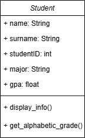

# I have created Class Student

## This class is a template to create student objects

## Student class attributes:
- ### name
- ### surname
- ### student ID
- ### major
- ### gpa

## Student class methods:
- ### display_info() - displays all attributes(info) of student
- ### get_alphabetic_grade() - returns alphabetic grade according to gpa

## UML of Student Class
